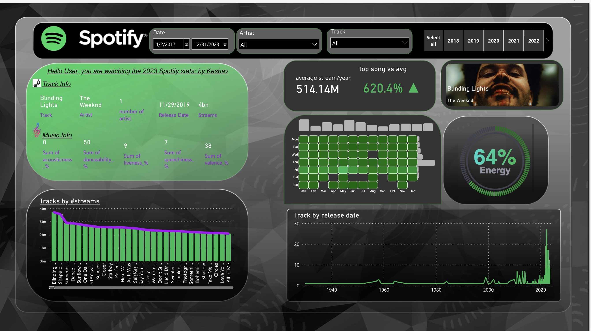

# Spotify Analytics Dashboard

Overview
This project is a comprehensive Power BI dashboard designed to visualize and analyze Spotify's streaming data. The dashboard offers insights into the most streamed tracks, artists, and general trends in music consumption on Spotify, focusing on data from 2017 to 2023. The analysis includes various metrics such as the number of streams, track popularity, and audio features like danceability, energy, and acousticness.

Features
1. Tracks by Number of Streams
Visualization: A bar chart showcasing the top tracks by the total number of streams.
Insight: Provides a quick view of the most popular songs on Spotify, highlighting tracks like "Blinding Lights" by The Weeknd, which has over 4 billion streams.
2. Track Release Date Analysis
Visualization: A line graph displaying the number of tracks released over the years from 1940 to 2023.
Insight: Helps identify trends in music releases over the decades, indicating periods of higher musical output.
3. Top Song vs. Average Song Metrics
Visualization: Comparative metrics that display how top songs perform against average songs in terms of streams per year.
Insight: This metric highlights the disparity between top-performing tracks and the average song on Spotify, with "Blinding Lights" performing 620.4% better than the average track in its release year.
4. Audio Features Analysis
Visualization: Multiple charts focusing on various audio features such as danceability, energy, liveness, speechiness, and valence.
Insight: Provides an in-depth analysis of what makes popular songs resonate with listeners, breaking down songs into their core audio components.
5. Temporal Patterns in Streaming
Visualization: A heat map that visualizes streaming patterns by day and month.
Insight: Reveals when users are most active in streaming music, showing trends in daily and monthly listening habits.
Data Source
The data used for this analysis is sourced from Spotify’s streaming data, which includes detailed metrics on individual tracks, artists, and their respective audio features.

Technical Details
Tools Used: Power BI for data visualization, with additional data preprocessing and transformation done within Power BI.
Data Handling: The dataset was cleaned and processed to ensure accurate and meaningful visualizations. Calculations like total streams, average streams per year, and percentage comparisons were created using DAX formulas in Power BI.
How to Use
Download and Install Power BI Desktop: If you don't already have Power BI Desktop installed, you can download it from here.
Clone or Download the Project Files: You can find the Power BI file and the associated documentation in this repository.
Open the Project: Open the .pbix file in Power BI Desktop to explore the dashboard. You can interact with the visualizations to filter data, drill down into specific insights, and understand the underlying trends.
Conclusion
This project offers a deep dive into Spotify's streaming data, providing valuable insights into what makes certain tracks popular and how streaming behavior has evolved over time. The dashboard is a powerful tool for music industry analysts, marketers, and enthusiasts looking to understand the dynamics of music consumption on Spotify.

